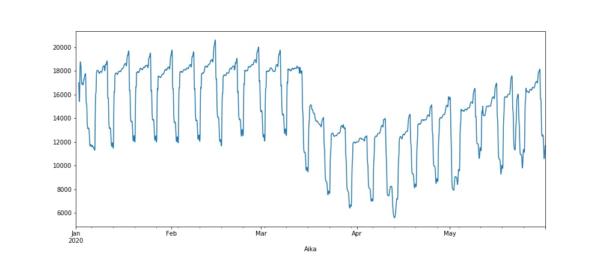
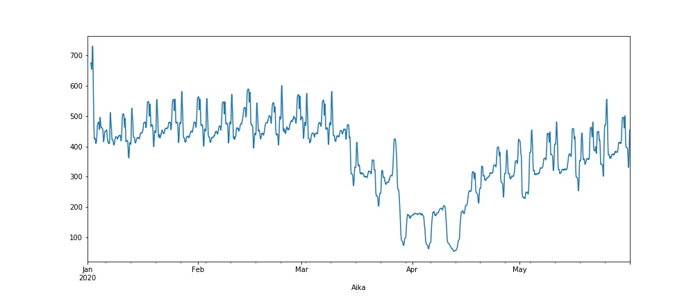

# LAM-data during Jan2020-May2020 in Finland

My first Dash app uses LAM-data from here: https://aineistot.vayla.fi/lam/reports/LAM/
to show changes in traffic. First 2-3 months show situation before covid-19
pandemic and from March to end of May depict situation during the pandemic.
This is a selection of LAM-points from Finland.
I used this data previously in my studies in data analytics and artificial intelligence.

## Built With

* Python
* Pandas
* Dash

## Author

Satu Korhonen

## Preview images

Situation (rolling average for 24h) in total of all points selected for this app:

Situation (rolling average for 24h) at point 248 - Salo Muurla 

Situation (rolling average for 24h) at point 1431 - Tornio

## Sources:

* Plotly Dash Tutorial: https://dash.plotly.com/installation
* My own coursework at 30 ects Data analytics and artificial intelligence
